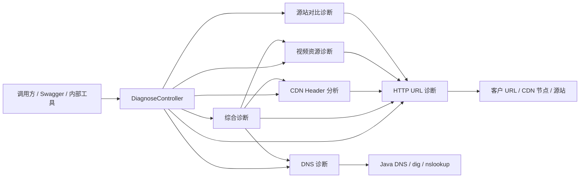
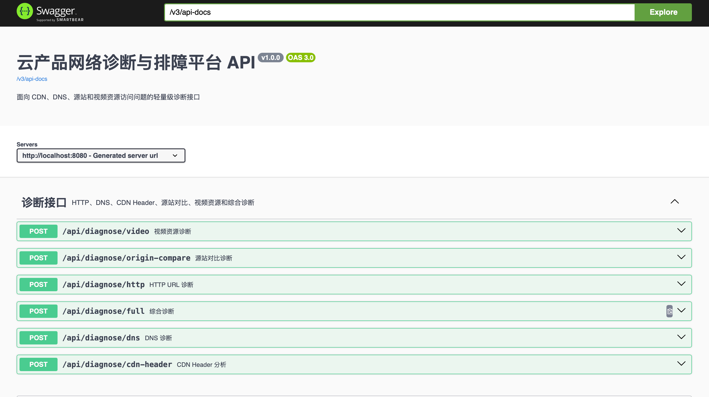
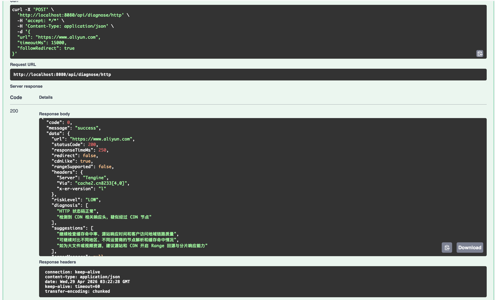

# cloud-media-diagnosis-platform

中文名：云产品网络诊断与排障平台

`cloud-media-diagnosis-platform` 是一个面向云产品技术支持、CDN 排障、HTTP/DNS 诊断、源站对比分析和视频资源访问问题定位的轻量级诊断平台。项目基于 Java 17 和 Spring Boot 3.x 构建，不依赖数据库，不接入真实云厂商 API，适合用作内部排障工具、诊断流程原型或云产品支持场景下的自动化检测服务。

## 项目背景

在 CDN、对象存储、视频点播、直播分发和网站加速等云产品支持场景中，客户常见反馈包括访问慢、缓存不生效、URL 返回异常状态码、源站响应慢、DNS 解析异常、视频首帧慢和 CDN 节点访问结果与源站不一致等。

这类问题通常需要从多个维度快速收敛方向：DNS 是否正常解析、请求是否经过 CDN、缓存是否命中、状态码来自 CDN 还是源站、Range 是否支持、源站与 CDN 响应是否一致。该平台将这些常见排障动作抽象为标准化接口，并输出可读的诊断结论、风险等级和下一步排查建议。

## 适用场景

- 云产品技术支持团队的一线 URL 快速检测
- CDN 加速域名缓存命中、回源异常、状态码异常排查
- HTTP 响应头、状态码、响应耗时和 Range 支持能力分析
- 域名 A 记录和 CNAME 调度链路检查
- CDN URL 与源站 URL 的响应差异对比
- 视频文件播放慢、首帧慢、拖拽失败、分片异常的初步诊断
- 内部诊断平台、工单系统或运维工具链的后端诊断能力原型

## 技术栈

- Java 17
- Spring Boot 3.x
- Maven
- Spring Web
- Jakarta Validation
- Lombok
- Springdoc OpenAPI / Swagger
- Hutool
- Docker / docker-compose
- JUnit 5

## 系统架构



## 功能模块

| 模块 | 接口 | 说明 |
| --- | --- | --- |
| HTTP URL 诊断 | `POST /api/diagnose/http` | 校验 URL，发起 HEAD 请求并在失败时降级 GET，分析状态码、响应耗时、关键响应头、重定向、CDN 特征和 Range 支持能力 |
| DNS 诊断 | `POST /api/diagnose/dns` | 解析域名 A 记录，尝试获取 CNAME，识别疑似 CDN 调度域名并输出 DNS 侧建议 |
| CDN Header 分析 | `POST /api/diagnose/cdn-header` | 分析 `Cache-Control`、`Age`、`Via`、`X-Cache`、`ETag`、`Last-Modified` 等 Header，判断缓存状态和缓存风险 |
| 源站对比诊断 | `POST /api/diagnose/origin-compare` | 分别请求 CDN URL 与源站 URL，支持源站请求指定 Host Header，对比状态码、耗时、长度、类型和 Server |
| 视频资源诊断 | `POST /api/diagnose/video` | 判断视频类型、Content-Type、Range、Content-Length、大文件风险，并针对 mp4、m3u8、flv 输出播放体验建议 |
| 综合诊断 | `POST /api/diagnose/full` | 自动提取域名并编排 DNS、HTTP、CDN Header 和视频诊断，生成综合风险、可能原因、下一步动作和客户回复模板 |

## 快速启动

本地启动：

```bash
mvn spring-boot:run
```

打包验证：

```bash
mvn clean package
```

Docker 启动：

```bash
docker compose up -d --build
```

Swagger 地址：

```text
http://localhost:8080/swagger-ui/index.html
```

## 界面预览

### Swagger 接口文档

启动服务后，可以通过 Swagger 查看全部诊断接口、请求参数和响应结构。



### HTTP URL 诊断结果

HTTP URL 诊断会返回状态码、响应耗时、关键 Header、CDN 特征、Range 支持能力、风险等级和排障建议。



## 接口约定

所有接口统一返回：

```json
{
  "code": 0,
  "message": "success",
  "data": {}
}
```

异常返回：

```json
{
  "code": 400,
  "message": "URL 格式不合法",
  "data": null
}
```

## 接口示例

### HTTP URL 诊断

```bash
curl -X POST http://localhost:8080/api/diagnose/http \
  -H 'Content-Type: application/json' \
  -d '{"url":"https://example.com/video/test.mp4","timeoutMs":5000,"followRedirect":true}'
```

示例诊断效果：


### DNS 诊断

```bash
curl -X POST http://localhost:8080/api/diagnose/dns \
  -H 'Content-Type: application/json' \
  -d '{"domain":"www.example.com"}'
```

### CDN Header 分析

```bash
curl -X POST http://localhost:8080/api/diagnose/cdn-header \
  -H 'Content-Type: application/json' \
  -d '{"url":"https://example.com/index.html"}'
```

### 源站对比诊断

```bash
curl -X POST http://localhost:8080/api/diagnose/origin-compare \
  -H 'Content-Type: application/json' \
  -d '{"cdnUrl":"https://www.example.com/index.html","originUrl":"http://1.1.1.1/index.html","hostHeader":"www.example.com"}'
```

### 视频资源诊断

```bash
curl -X POST http://localhost:8080/api/diagnose/video \
  -H 'Content-Type: application/json' \
  -d '{"url":"https://example.com/video/test.mp4"}'
```

### 综合诊断

```bash
curl -X POST http://localhost:8080/api/diagnose/full \
  -H 'Content-Type: application/json' \
  -d '{"url":"https://www.example.com/video/test.mp4"}'
```

## 诊断规则

### HTTP 状态码

- `2xx`：访问正常，继续关注缓存命中率、源站耗时、客户地域和运营商链路。
- `3xx`：检查重定向链路、`Location`、HTTPS 跳转配置和跳转次数。
- `403`：检查权限、防盗链、Referer、签名 URL、WAF/ACL 规则。
- `404`：检查资源路径、源站文件是否存在、CDN 是否缓存异常状态码。
- `502`：检查源站连接、网关、反向代理、TLS 握手和回源 Host。
- `504`：检查源站响应超时、回源链路、CDN 回源超时配置和源站负载。
- `5xx`：检查源站服务日志、负载均衡健康检查、CDN 节点回源错误日志。

### CDN 与缓存

- CDN 特征识别：通过 `Via`、`Age`、`X-Cache`、`X-Cache-Status`、`Server` 等 Header 判断请求是否疑似经过 CDN。
- 缓存状态判断：优先根据 `X-Cache`、`X-Cache-Status` 判断 `HIT`、`MISS`、`BYPASS`，无法识别时返回 `UNKNOWN`。
- 缓存风险识别：`Cache-Control` 包含 `no-cache`、`no-store`、`private` 时提示资源可能不会被 CDN 缓存。
- `Age` 缺失：提示可能未命中缓存、直连源站，或 CDN 未透出缓存年龄。
- `Set-Cookie` 存在：提示该响应可能被视为动态内容，需要检查 CDN 缓存键和 Cookie 策略。

### DNS

- A 记录无解析结果：提示 DNS 配置异常或递归解析链路不可用。
- 多 IP 返回：提示可能存在负载均衡、GSLB 调度或 CDN 节点调度。
- CNAME 命中 CDN 关键词：提示疑似接入 CDN。
- CDN CNAME 关键词包括：`cdn`、`alicdn`、`cloudfront`、`edgekey`、`akamai`、`volc`、`bytedance`、`tencent`、`wsdvs`。

### 源站对比

- CDN 正常、源站异常：优先排查源站服务、源站负载、回源端口和健康检查。
- CDN 异常、源站正常：优先排查 CDN 配置、缓存状态码、防盗链、回源 Host 和节点日志。
- CDN 慢、源站快：关注节点调度、缓存未命中、节点到源站链路质量。
- CDN 快、源站慢：说明 CDN 缓存或边缘节点加速可能有效。
- 状态码不一致：检查缓存、回源 Host、源站配置、重定向规则和历史异常缓存。

### 视频资源

- mp4：检查 `moov atom` 是否前置，确认 Range 请求、缓存预热和首包时间。
- m3u8：检查 ts 分片访问、跨域 CORS、分片缓存策略和分片 404。
- flv：关注长连接稳定性、首包时间、CDN 节点质量和源站链路。
- 未支持 Range：提示拖拽、分片加载或大文件续传可能异常。
- 缺少 Content-Length：提示播放器可能无法准确预估缓冲和文件大小。

## 设计思路

- 诊断链路按云产品排障习惯拆分为 DNS、HTTP、CDN Header、源站对比、视频资源和综合诊断，单个模块可独立使用，也可由综合诊断统一编排。
- Controller 层只负责参数接收和服务调用，业务规则集中在 Service 和 Util 中，便于后续接入真实 CDN API、日志平台或工单系统。
- HTTP 探测优先使用 HEAD 请求，遇到不支持 HEAD 的站点时自动降级为 GET，减少对目标资源的下载开销，同时提高诊断成功率。
- DNS 模块使用 Java 标准库解析 A 记录，并尝试通过 `dig` 或 `nslookup` 获取 CNAME；系统缺少命令时优雅降级，不影响基础诊断。
- 输出结果同时包含机器可读字段和人工可读建议，便于被前端、工单系统、自动化脚本或技术支持流程复用。

## 项目结构

```text
src/main/java/com/example/clouddiagnosis
├── config
│   ├── OpenApiConfig.java
│   └── RestClientConfig.java
├── controller
│   └── DiagnoseController.java
├── exception
│   ├── BizException.java
│   └── GlobalExceptionHandler.java
├── model
│   ├── common
│   ├── request
│   └── response
├── service
│   ├── HttpDiagnoseService.java
│   ├── DnsDiagnoseService.java
│   ├── CdnHeaderAnalyzeService.java
│   ├── OriginCompareService.java
│   ├── VideoDiagnoseService.java
│   └── FullDiagnoseService.java
└── util
    ├── UrlUtils.java
    ├── HeaderUtils.java
    ├── CommandUtils.java
    └── DiagnoseRuleUtils.java
```

## 后续规划

- 接入真实 CDN 厂商 API，查询域名配置、缓存规则、刷新预热、回源配置和节点日志。
- 接入 Prometheus 监控数据，关联源站 QPS、延迟、错误率和资源负载。
- 接入日志平台，按请求 ID、客户 IP、URL、时间范围检索访问日志。
- 增加多地域、多运营商探测节点，支持跨区域访问质量对比。
- 增加 HTTPS 证书链、证书有效期、SNI 和 TLS 握手诊断。
- 接入大模型生成 RCA，自动输出根因分析报告、排查过程摘要和客户沟通模板。
- 增加前端页面，提供一键诊断、历史报告、诊断结果导出。
- 增加工单系统集成，将诊断报告自动附加到客户工单。
