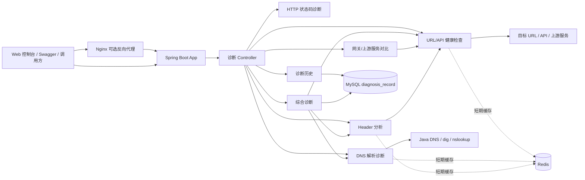

# Web 应用故障诊断与运维支持平台

本项目面向技术支持、应用运维、实施运维和 SaaS 产品支持场景，提供 URL/API 健康检查、HTTP 状态码分析、响应耗时分析、Header 检查、DNS 解析、网关/上游服务异常判断、诊断记录保存、历史查询和重复诊断缓存能力，用于提升客户问题首轮定位、部署验证和故障复盘效率。

项目基于 Java 17 和 Spring Boot 3.x 构建，提供轻量级 Web 控制台、Swagger API 文档、MySQL 诊断历史、Redis 短期缓存，以及可选 Nginx 反向代理部署配置。CDN、视频资源和边缘缓存相关能力作为扩展诊断场景保留，但不作为主定位。

## 核心功能

| 功能 | 说明 |
| --- | --- |
| URL/API 健康检查 | 检测 URL/API 连通性、状态码、响应耗时、关键 Header、重定向和风险等级 |
| HTTP 状态码诊断 | 覆盖 400、401、403、404、408、429、500、502、503、504 等常见 Web/API 异常 |
| Header 分析 | 检查 Content-Type、Cache-Control、Set-Cookie、Location、Server、CORS 和安全 Header |
| DNS 解析诊断 | 解析 A 记录，尝试获取 CNAME，判断解析耗时和多 IP 调度情况 |
| 网关/上游服务对比诊断 | 对比公网入口 URL 与上游服务 URL 的状态码、响应耗时和响应头差异 |
| 综合诊断报告 | 汇总 DNS、HTTP、Header 和扩展场景结果，输出风险等级、摘要和排查建议 |
| 诊断记录保存 | 将综合诊断结果保存到 MySQL，便于复盘和关联工单 |
| 诊断历史查询 | 支持按 URL、状态码、风险等级和时间范围查询诊断记录 |
| Redis 短期缓存 | 对重复 URL/API 诊断、DNS 解析和 Header 分析做短期缓存，默认 TTL 300 秒 |
| Nginx 反向代理部署 | 通过 8088 端口模拟企业 Web 应用网关接入场景 |
| Web 控制台 | 基于 Spring Boot 静态资源提供轻量操作页面，无需前端框架 |
| Swagger API 文档 | 提供完整接口文档和在线调试入口 |
| Docker Compose 部署 | 一键启动 Spring Boot 应用、MySQL、Redis 和 Nginx |

## 技术栈

- Java 17
- Spring Boot 3.x
- Spring Web
- Spring Data JPA
- MySQL 8
- Redis
- Nginx
- Springdoc OpenAPI / Swagger
- Jakarta Validation
- Lombok
- Hutool
- Maven
- Docker / Docker Compose
- JUnit 5
- HTML / CSS / JavaScript

## 系统架构



## 访问地址

Spring Boot Web 控制台：

```text
http://localhost:8080/
```

Nginx 反向代理入口：

```text
http://localhost:8088/
```

Swagger：

```text
http://localhost:8080/swagger-ui/index.html
http://localhost:8088/swagger-ui/index.html
```

Health：

```text
http://localhost:8080/api/health
http://localhost:8088/api/health
```

## 快速启动

本地启动。默认使用内置 H2 数据库，Redis 不可用时会自动降级为直接诊断：

```bash
mvn spring-boot:run
```

运行测试：

```bash
mvn test
```

Docker Compose 启动：

```bash
docker compose up -d --build
```

`docker-compose` 会启动：

- `app`：Spring Boot 应用，端口 `8080`
- `mysql`：MySQL 8，端口 `3306`
- `redis`：Redis，端口 `6379`
- `nginx`：可选反向代理，宿主机端口 `8088`

## MySQL 诊断历史

MySQL 用于保存综合诊断记录和历史报告。表名为 `diagnosis_record`，核心字段包括：

- `request_url`
- `diagnosis_type`
- `status_code`
- `risk_level`
- `summary`
- `suggestions`
- `raw_result_json`
- `created_at`
- `updated_at`

历史查询支持按 URL、状态码、风险等级和时间范围过滤，用于问题复盘和工单追踪。通过 Docker Compose 启动时，应用会连接 MySQL：

```text
jdbc:mysql://mysql:3306/diagnosis_db
```

## Redis 短期缓存

Redis 用于重复 URL/API 诊断结果、DNS 解析结果和 Header 分析结果的短期缓存，默认 TTL 为 300 秒。

缓存示例：

- `diagnosis:http:{urlHash}`
- `diagnosis:dns:{domain}`
- `diagnosis:header:{urlHash}`

Redis 不可用时系统会记录 warning 日志，并降级为直接诊断，不影响主流程。

## Nginx 反向代理

Nginx 用于模拟企业 Web 应用网关接入场景，通过 `8088` 端口反向代理到 Spring Boot 应用 `app:8080`。

代理路径包括：

- `/`
- `/api/`
- `/swagger-ui/`
- `/v3/api-docs/`

该配置可用于理解和演示 502、504 等网关异常排查思路，例如 upstream 不可达、上游响应超时、转发路径错误和 Header 透传问题。

## 接口约定

业务接口统一返回：

```json
{
  "code": 0,
  "message": "success",
  "data": {}
}
```

异常返回：

```json
{
  "code": 400,
  "message": "URL 格式不合法",
  "data": null
}
```

健康检查接口返回：

```json
{
  "status": "UP",
  "service": "web-diagnosis-platform"
}
```

## 接口示例

### URL/API 健康检查

```bash
curl -X POST http://localhost:8080/api/diagnose/http \
  -H 'Content-Type: application/json' \
  -d '{"url":"https://example.com","method":"GET","timeoutMs":5000,"followRedirect":true,"useCache":true}'
```

### HTTP 状态码诊断

```bash
curl -X POST http://localhost:8080/api/diagnose/status-code \
  -H 'Content-Type: application/json' \
  -d '{"statusCode":504,"errorMessage":"upstream timed out","path":"/api/order/list"}'
```

### Header 分析

```bash
curl -X POST http://localhost:8080/api/diagnose/header \
  -H 'Content-Type: application/json' \
  -d '{"url":"https://example.com","useCache":true}'
```

兼容旧接口：

```text
POST /api/diagnose/cdn-header
```

### DNS 解析诊断

```bash
curl -X POST http://localhost:8080/api/diagnose/dns \
  -H 'Content-Type: application/json' \
  -d '{"domain":"www.example.com","useCache":true}'
```

### 网关/上游服务对比诊断

```bash
curl -X POST http://localhost:8080/api/diagnose/origin-compare \
  -H 'Content-Type: application/json' \
  -d '{"cdnUrl":"https://www.example.com/index.html","originUrl":"http://1.1.1.1/index.html","hostHeader":"www.example.com"}'
```

### 综合诊断并保存记录

```bash
curl -X POST http://localhost:8080/api/diagnose/full \
  -H 'Content-Type: application/json' \
  -d '{"url":"https://www.example.com","scenario":"web_api","saveRecord":true,"useCache":true}'
```

### 查询诊断历史

```bash
curl 'http://localhost:8080/api/diagnose/history?page=0&size=10'
```

### 查看诊断详情

```bash
curl http://localhost:8080/api/diagnose/history/1
```

### 删除诊断记录

```bash
curl -X DELETE http://localhost:8080/api/diagnose/history/1
```

### 视频资源扩展诊断

```bash
curl -X POST http://localhost:8080/api/diagnose/video \
  -H 'Content-Type: application/json' \
  -d '{"url":"https://example.com/video/test.mp4"}'
```

## 状态码诊断规则

| 状态码 | 分类 | 常见方向 |
| --- | --- | --- |
| 400 | BAD_REQUEST | 请求参数错误、JSON 格式错误、必填字段缺失 |
| 401 | UNAUTHORIZED | 未登录、Token 过期、Authorization Header 缺失、认证失败 |
| 403 | FORBIDDEN | 权限不足、角色策略、IP 白名单、访问控制、鉴权策略异常 |
| 404 | NOT_FOUND | 接口路径错误、资源不存在、路由配置错误、Nginx 转发路径错误 |
| 408 | REQUEST_TIMEOUT | 请求超时、客户端网络不稳定、服务响应慢 |
| 429 | TOO_MANY_REQUESTS | 限流、频控、API 配额不足、并发过高 |
| 500 | INTERNAL_SERVER_ERROR | 应用异常、代码异常、数据库异常、配置异常 |
| 502 | BAD_GATEWAY | 网关无法获得有效上游响应、服务未启动、端口不可达、upstream 配置错误 |
| 503 | SERVICE_UNAVAILABLE | 服务不可用、实例下线、发布中、健康检查失败 |
| 504 | GATEWAY_TIMEOUT | 上游响应超时、慢 SQL、第三方接口超时、线程池或连接池耗尽 |

## 操作演示流程

1. 使用 Docker Compose 启动项目：`docker compose up -d --build`
2. 打开 Web 控制台：`http://localhost:8080/`
3. 执行 URL/API 健康检查，查看状态码、响应时间、Header 和风险等级。
4. 执行 504 状态码诊断，查看可能原因、排查步骤和需要补充的信息。
5. 执行 Header 分析，检查缓存、CORS、安全 Header 和跳转信息。
6. 执行综合诊断并保存记录。
7. 打开诊断历史记录，查看最近诊断报告。
8. 再次执行相同 URL 诊断，观察返回结果中的 `cached` 字段。
9. 通过 Nginx 入口访问 Web 控制台和 Swagger：`http://localhost:8088/`
10. 查看 Swagger 文档并调试 API。

## 项目结构

```text
src/main/java/com/example/clouddiagnosis
├── config
├── controller
├── entity
├── exception
├── model
│   ├── common
│   ├── request
│   └── response
├── repository
├── service
└── util

src/main/resources/static
├── index.html
├── app.js
└── style.css

deploy/nginx
└── nginx.conf
```

## 后续优化方向

- 更丰富的诊断规则和场景模板
- 批量 URL/API 诊断
- GitHub Actions CI
- 监控指标和告警接入
- 更完善的 Nginx 网关故障模拟
- 诊断报告导出
- 与工单系统关联诊断记录
